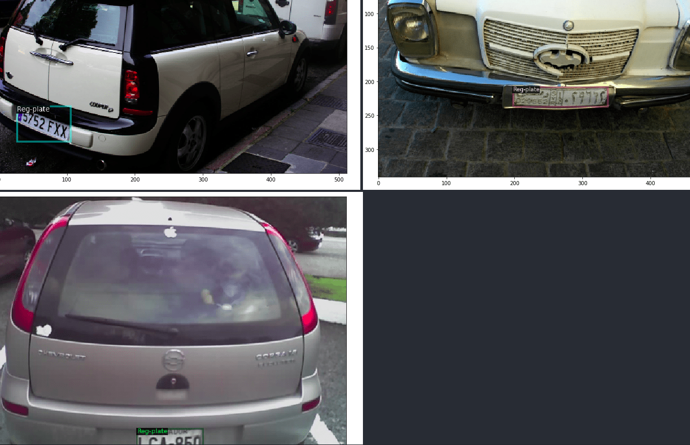

# Automatic Number Plate Recognition (ANPR) for Electronic Toll Collection

## Overview
Automatic Number Plate Recognition (ANPR) is a crucial component of Electronic Toll Collection (ETC) systems. The primary objective of this project is to detect and recognize vehicle registration plates from images. This involves processing a dataset containing labeled images of vehicle registration plates.


## Dataset
The dataset for this project can be downloaded from the following link:
[Vehicle Registration Plate Dataset](https://www.dropbox.com/s/k81ljpmzy3fgtx9/Dataset.zip?dl=1)

### Directory Structure
Once the dataset is downloaded and extracted, it will have the following structure:

```plaintext
Dataset/
├── train/
│   ├── Vehicle registration plate/
│   │   ├── *.jpg
│   │   ├── Label/
│   │       ├── *.txt
├── validation/
    ├── Vehicle registration plate/
    │   ├── *.jpg
    │   ├── Label/
    │       ├── *.txt
```

- **`train/`** - Contains training images and corresponding label files.
- **`validation/`** - Contains validation images and corresponding label files.
- **`Vehicle registration plate/`** - Stores the `.jpg` images of vehicle registration plates.
- **`Label/`** - Stores the bounding box annotations in `.txt` files.

## Data Format
Each image has a corresponding label file in the `Label/` directory.

### Example
For the image:
```
Dataset/train/Vehicle registration plate/bf4689922cdfd532.jpg
```
The corresponding label file is:
```
Dataset/train/Vehicle registration plate/Label/bf4689922cdfd532.txt
```

### Bounding Box Format
Each `.txt` file contains one or more lines, where each line represents a bounding box for a detected vehicle registration plate. The format follows:

```plaintext
Vehicle registration plate xmin ymin xmax ymax
```

**Example:**
```plaintext
Vehicle registration plate 385.28 445.15 618.24 514.225
Vehicle registration plate 839.68 266.066462 874.24 289.091462
```

- The dataset follows a **single-class detection** format (`Vehicle registration plate detection`).
- The bounding box is represented using **(xmin, ymin, xmax, ymax)** coordinates.

## Dataset Statistics
- **Training Samples:** `5308`
- **Validation Samples:** `386`

## Usage
### Prerequisites
Ensure you have the following installed:
- Python 3.x
- TensorFlow/PyTorch
- OpenCV
- NumPy

### Steps
1. **Download and unzip the dataset**
2. **Load the dataset** into a deep learning-based object detection model such as YOLO, Faster R-CNN, or SSD.
3. **Preprocess the dataset** as required by your chosen model.
4. **Train the model** using the training dataset.
5. **Evaluate the model** on the validation dataset.

## License
This dataset and project are intended for research and educational purposes.

## Acknowledgments
- The dataset is provided for ANPR research and experimentation.
- Thanks to contributors and open-source communities for tools and frameworks used in this project.

